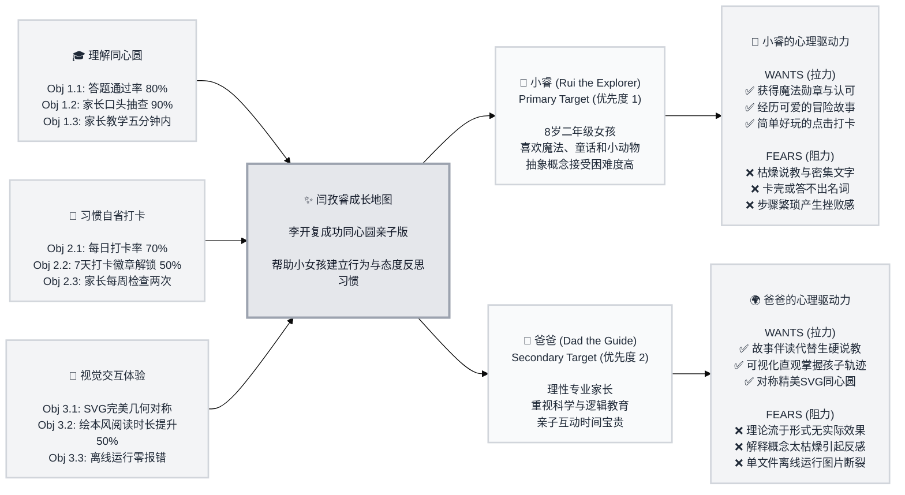

# Trigger Map Poster: 闫孜睿成长地图

> Visual overview connecting business goals to user psychology

**Created:** 2026-06-06
**Author:** Yanhaizhe
**Methodology:** Based on Effect Mapping (Balic & Domingues), adapted for WDS framework
**Status:** Approved (Dream Mode Synthesis)

---

## Detailed Documentation Menu

This is the visual hub. For detailed documentation on specific strategy layers, see:

- 📊 **[01-Business-Goals.md](01-Business-Goals.md)** - Full 3x3 educational vision and measurable SMART objectives.
- 👥 **[02-Target-Groups.md](02-Target-Groups.md)** - Targeted user groups, prioritization reasoning, and cross-group patterns.
- 👧 **[personas/03-Rui-the-Explorer.md](personas/03-Rui-the-Explorer.md)** - Detailed psychological profile and transformation journey for Rui (8yo girl).
- 👨 **[personas/04-Dad-the-Guide.md](personas/04-Dad-the-Guide.md)** - Detailed profile, validation strategy, and conversion path for the parent.
- 🎯 **[05-Feature-Impact-Analysis.md](05-Feature-Impact-Analysis.md)** - Feature impact analysis with prioritization scores (MVP decisions).

---

## Vision

> “让每个孩子（尤其是小女孩）通过生动可爱的故事冒险和趣味习惯打卡，能够轻松理解并把《做最好的自己》成功同心圆模型转化为日常自发的行为检查与思维反思，建立健全诚信价值观，健康快乐地成长为最好的自己。”

---

## Target Groups & Key Drivers Summary

### 1. 小睿 (Rui the Explorer) — Priority 1 (Primary)
* **Transformation:** From a confused child overwhelmed by dry lectures ➡️ to a self-motivated explorer eager to review her daily character progress.
* **Key Positive Drivers:**
  - 🏆 获得金黄色的“魔法徽章”奖励，带给其强烈的自我认同感和成就感（放学打卡动力）。
  - 📖 经历充满童趣和可爱魔法的连环画式故事冒险（提升兴趣与记忆点）。
  - 📝 一键拖动滑块或心情卡片的轻量级点击反馈（消除交互心理压力）。
* **Key Negative Drivers:**
  - 🚫 讨厌大段死板的纯理论讲解，这会让她在打开页面 10 秒内失去兴趣并关闭。
  - 🚫 害怕被爸爸抽查概念时记不住词汇，从而产生挫折感和逃避心理。

### 2. 爸爸/妈妈 (Dad the Guide) — Priority 2 (Secondary)
* **Role in Success:** Sets up the offline HTML environment, guides bed-time reading, and reviews weekly check-in summaries.
* **Key Positive Drivers:**
  - 🗺️ 拥有完美几何对称、无重叠、标注清晰的 SVG 成功同心圆作为心智模型图示。
  - 💬 依靠可爱的冒险故事作为睡前伴读桥梁，自然传递价值观，避免干瘪说教。
  - 📊 每周仅花 5 分钟就能直观查阅孩子当天的打卡记录和心理热度变化。
* **Key Negative Drivers:**
  - 🚫 担心系统华而不实，孩子三分钟热度，无法真正养成持久的日常自省习惯。
  - 🚫 担心单文件离线运行中因为图片路径破损导致界面坍塌或资源加载报错。

---

## Trigger Map Visualization

---

## Design Focus Statement

**Primary Design Target:** 小睿 (Rui the Explorer)

**Must Address (High Priority Drivers):**
- 🏆 **魔法勋章与自我认同反馈** (Rui Want - Score 15): 在页面显眼位置设计“我的魔法成就陈列室”，让每日的打卡行为获得即时徽章解锁激励。
- 🚫 **杜绝枯燥大段说教文本** (Rui Fear - Score 15): 绘本语言必须极度童趣化、口语化，杜绝纯文字说教，将复杂的概念替换成冒险历程。
- 📖 **用魔法宝石与跑鞋故事解释模型** (Dad Want - Score 14): 重构《小人书.html》将价值观化作地基，态度化作宝石，行为化作跑鞋。
- 📝 **无打字负担的轻量滑块交互** (Rui Want - Score 14): 打卡必须极简，通过表情点选与拖拽滑块完成，操作在 5 秒内闭环。

**Should Address (Medium Priority Drivers):**
- 📊 **可视化打卡轨迹统计** (Dad Want - Score 13): 成长地图中提供轻量级的本地 LocalStorage 数据报表，给爸爸提供了解女儿的一手资料。
- 🚫 **概念检验趣味小问答** (Rui Fear - Score 12): 答题应采取极简选择题形式，并在选错时给予温和、卡通化的鼓励，避免产生惩罚性挫败感。

---

## How to Read This Map

1. **从左至右阅读 (Left-to-Right Flow):** 
   - 左侧为项目期望达成的**业务与教育目标 (Business Goals)**；
   - 目标流向中间的**产品载体 (Platform)**；
   - 产品载体将功能提供给不同的**目标人群 (Target Groups)**；
   - 右侧是这些目标人群在使用产品时的**心理驱动力 (Driving Forces)**（✅ 代表促使其使用的想要，❌ 代表阻碍其使用的担忧）。
2. **从上至下优先级 (Top-to-Bottom Priority):**
   - 目标、人群以及心理驱动力均按照影响项目的优先级由高到低排列。
3. **驱动设计决策 (Drive Design Decisions):**
   - 所有的功能开发都必须回溯到右侧的心理驱动力。如果一个功能无法解决任何一个 Want 或 Fear，该功能应该被删减或暂缓。

---

## Next Steps

This Trigger Map Poster provides a quick reference. The following phases can now proceed:

- [ ] **Phase 3: UX Scenarios** - Define user scenarios using target awareness and persona drivers
- [ ] **Phase 4: UX Design** - Design layouts and SVG coordinates based on the focus statement

---

_Generated with Whiteport Design Studio framework_  
_Trigger Mapping methodology credits: Effect Mapping by Mijo Balic & Ingrid Domingues (inUse), adapted with negative driving forces_
